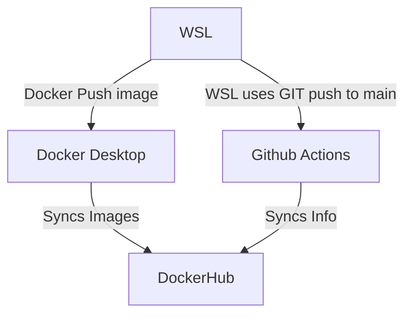

# CI - Part 1

> Why and how

Making docker containers to build nginx webservers for school , using Dockerhub and nginx. 

> Run Project Locally

Sudo apt install docker to install docker on wsl2, then enable wsl2 support in the Dockerhub desktop settings.

### Dockerfile:
--------------------------------------------
syntax=docker/dockerfile:1

FROM nginx:latest

RUN apt-get update

RUN apt-get install -y nginx-full

COPY index.html /usr/share/nginx/html

COPY headers.css /usr/share/nginx/html

EXPOSE 80

CMD ["nginx", "-g", "daemon off;"]

----------------------------------------------

> how to run the container

- docker run [OPTIONS] IMAGE [COMMAND] [ARG...]

> how to view the project running in the container (open a browser...go to IP and port...)

- You can easily click on the localhost link in the docker desktop container to view the project running in the web browser of your choice.

# CI - Part 2

> Process to create public repo in DockerHub

Log in to Docker-hub on yur favorite web browser , then select repositories and then make a public one under a specified name. 

> How to authenticate with DockerHub via CLI using Docker-hub credentials

in WSL: 
docker login --username="yourusername"
Then it will prompt you to enter your password. it will then log you in.

> what credentials would you recommend providing?

Username and then an access token provided by Docker. You can get one of the following from the website under your login credentials at settings > Security > tokens.

Tokens are more secure than using passwords.

> How to push container image to Dockerhub (without GitHub Actions)

Tag your image with the repository you want to push then  use docker push. 

 - docker tag 485040c63907b23e60702e6f35e2bd5976c4c2e1880cb2592176c5e2ea126efc sudotronic/project04
 then 
 - docker push sudotronic/project04

> How to set a secret , What secret(s) are set for this project?

 - To set secrets go to the class fork repository for your github username, click settings, then secrets. Set secrets there. We are using the docker usernames and passwords for this. 

> Behavior of GitHub workflow. 
> what does it do and when? 

Every time you push a commit to the main branch, this workflow will be triggered. It will build a Docker image from the Dockerfile in my repository, tag it with the "latest" tag, and push it to your DockerHub repository. You can add additional tags by modifying the tags section of the workflow file.

> What variables in workflow are custom to your project? 

"your-dockerhub-username/your-repo-name:latest"

is replaced with 

sudotronic/project04:latest

>Do you think it may need to be changed if someone else is going to use it or you reuse it?

Yes, they would need to change it to specify the repository name and their username.

# CI - Part 3 

Markdown integration? Count me in!

